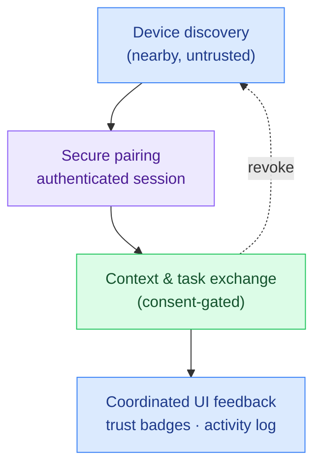

# CrossForge

**▶ Live demo: https://parag-labs.github.io/cross-forge/** — a Flutter app running on the web
(also runs natively via `flutter run`). No backend, no accounts, no cloud.

A privacy-respecting **multi-device personal mesh**. Your own devices — phone, tablet, watch,
laptop — discover each other, pair over an authenticated session, and coordinate simple shared
experiences: hand off a reading position, run a timer that mirrors on every device, share a scrap
of context. **Nothing is shared until you explicitly trust a device, and you can revoke any device
at any time.**

The demo starts with a populated mesh. Tap the action button on the *Work Laptop* card to walk it
through the full lifecycle — **discover → pair → trust → revoke** — and watch the activity log and
trust badges update live.

---

## Why

Multi-device experiences are the future, but the good ones are vendor-locked and cloud-bound. There
is a clear gap for an **open, local-first, consent-driven** mesh that treats your personal devices
as a small trusted fleet — without shipping your context to someone else's server.

## Core idea

The protocol lives in `lib/core/mesh.dart` as a deterministic state machine with **no Flutter
dependency**, so every rule is unit-tested:

```
discover → beginPairing → confirmPairing (secure session) → share context / coordinate tasks → revoke
```

- **Trust is a one-way ratchet.** A peer moves `discovered → pairing → trusted`, and can only drop
  to `revoked`. Illegal transitions are rejected, not silently allowed.
- **Sessions are order-independent.** `Session.between(a, b)` derives a stable fingerprint from the
  sorted device pair, so pairing the same two devices always yields the same session id (a stand-in
  for the shared secret of a real key exchange).
- **Consent gates sharing.** `shareContext`, reading hand-offs, and shared timers all refuse to run
  until at least one peer is trusted. A watch can't be a reading surface. Revoking a device tears
  its session down.

Because the core is pure and every mutation advances a logical tick, the whole thing is
reproducible and the UI is just a projection of engine state.

## Architecture



## Demo

```bash
flutter run -d chrome     # web
flutter run               # a device / simulator
```

Two trusted devices (tablet, watch), one still just *nearby* (laptop), a shared context key, a
reading hand-off, and a shared timer. Drive the laptop through the lifecycle to see pairing,
trust, and revocation reflected in the mesh.

## Design decisions

- **Local-first, consent-first.** No device receives context before it is trusted; there is no
  implicit broadcast. This is the whole point of the project.
- **Deterministic session ids.** Real crypto would supply the secret; the simulation uses a stable
  fingerprint so behavior is testable and the demo is reproducible. The seam (`Session.between`) is
  where a real key exchange would drop in.
- **Capability checks, not assumptions.** A watch can't be handed a reading position; the engine
  enforces this rather than trusting the caller.
- **Revocable by design.** Trust can always be withdrawn, and doing so removes the session — trust
  isn't a one-time gate.

## Testing

`flutter test` — 14 tests covering: idempotent discovery, valid/invalid trust transitions,
order-independent + stable session keys, consent-gated context sharing, reading hand-off capability
rules, monotonic + clamped shared timer, revocation tearing down sessions, and a deterministic,
strictly-ordered demo scenario.

```bash
flutter test
```

## Roadmap

- Real transports behind the `Device`/`Session` seam: Bluetooth LE, Wi-Fi Aware, local network.
- An authenticated key exchange to replace the fingerprint stand-in.
- More coordinated experiences (clipboard, notifications, presence) and a documented open protocol.

## Layout

```
cross-forge/
├── lib/
│   ├── core/
│   │   ├── mesh.dart      # pure Dart: devices, trust, sessions, tasks, log (unit-tested)
│   │   └── samples.dart   # deterministic demo devices + scenario
│   └── main.dart          # mesh dashboard: devices, trust badges, tasks, activity log
├── test/                  # 14 flutter_test unit tests
└── web/
```

## License

MIT — see [LICENSE](LICENSE).
